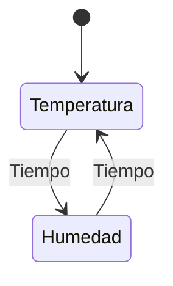
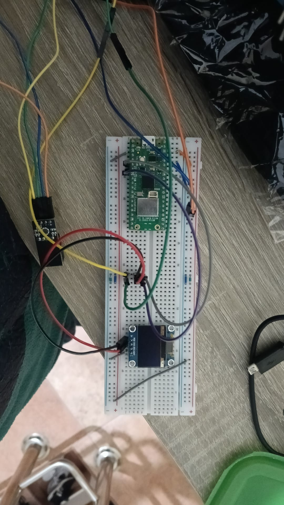

# Estacion meteorológica

Este proyecto consiste en una estación meteorológica compacta diseñada para medir y mostrar en tiempo real dos parámetros ambientales fundamentales:
- Temperatura
- Humedad relativa

La estación realiza lecturas en intervalos de tiempo de 5 segundos y muestra los valores obtenidos en una pantalla integrada, lo que permite visualizar el estado del ambiente de forma rápida y sencilla.

Las características principales de este proyecto son:
- Lectura periódica de temperatura, humedad.
- Intervalos de medición ajustables.
- Visualización clara de los datos en una pantalla.
- Código modular y fácil de extender.
- Arquitectura basada en una máquina de estados

## Hardware

Este es un proyecto basado en una Raspberry Pi Pico (RP2040), un microcontrolador con 2MB de memoria con acceso wifi y que a mayores cuenta con los siguientes periféricos:
- **Sensor DHT20:** un sensor para tomar medidas de humedad y temperatura
- **Pantalla SSD1306:** un controlador CMOS de un solo chip diseñado para gestionar paneles de matriz de puntos OLED/PLED

A la hora de programar y conectar estos elementos de hardware, nos basamos en sus datasheets correspondientes y en librerías de código abierto.

## Usos del proyecto  

Este proyecto podría ser util en ambientes en los que mantener estos dos parámetros estables y conocidos en todo momento es necesario. Por ejemplo:

- **Invernaderos:** para mantener controlados los parámetros en las medidas óptimas para el crecimiento de las plantas
- **Museos:** especialmente para controlar valores elevados de humedad que pueden poner en peligro la conservación de las obras de arte.

## Máquina de estados

Este proyecto sigue la siguiente máquina de estados para controlar su comportamiento:

## Pin-out

## Circuito físico

## Funcionamiento

## Datasheets

Enlaces a las datasheets en las que nos basamos:
- Raspberry Pi Pico: https://pip-assets.raspberrypi.com/categories/686-raspberry-pi-pico-w/documents/RP-008312-DS-1-pico-w-datasheet.pdf?disposition=inline
- **Sensor DHT20:** https://cdn.sparkfun.com/assets/8/a/1/5/0/DHT20.pdf
- **Pantalla SSD1306:** https://cdn-shop.adafruit.com/datasheets/SSD1306.pdf

## Integrantes del equipo
- Montserrat Redondo
    - Rol: Lider de integración
    - Funciones: coordinar el trabajo, controlar versiones y commits...
- Ángela Bretal 
    - Rol: Responsable de validación y documentación
    - Funciones: diseñar pruebas funcionales, redactar informe técnico...
- Xabier Alonso 
    - Rol: responsable de software y tiempo
    - Funciones: diseñar arquitectura software, asegurar modularidad...
- Alejandro Cabada 
    - Rol: Responsable de hardware y señales
    - Funciones: montar el circuito en la protoboard, documentar las conexiones...