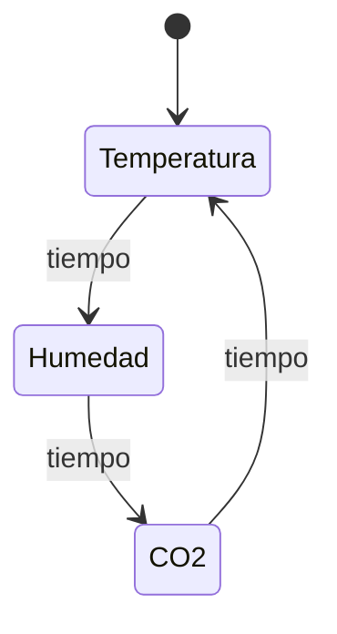

Este proyecto es una estación meteorológica compacta diseñada para medir y mostrar en tiempo real tres parámetros ambientales fundamentales:
    - Temperatura
    - Humedad relativa
    - Concentración de CO2
    
La estación realiza lecturas en intervalos de tiempo de 5 segundos y muestra los valores obtenidos en una pantalla integrada, lo que permite visualizar el estado del ambiente de forma rápida y sencilla.

Características principales
    - Lectura periódica de temperatura, humedad y CO₂.
    - Intervalos de medición ajustables.
    - Visualización clara de los datos en una pantalla.
    - Código modular y fácil de extender.

Este proyecto podría ser util en ambientes en los que mantener estos tres parámetros estables y conocidos en todo momento es necesario. Por ejemplo: en invernaderos, para mantener controlados los parámetros en las medidas óptimas para el crecimiento de las plantas o en museos, para controlar valores elevados de humedad o CO2 que pueden poner en peligro la conservación de las obras de arte.

Este proyecto sigue la siguiente máquina de estados para controlar su comportamiento:

